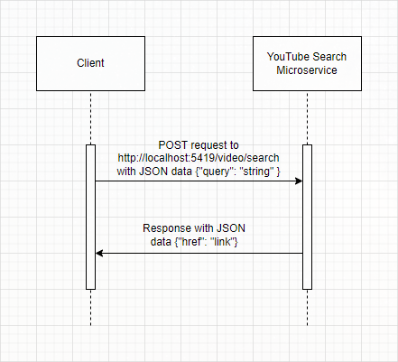

# YouTube Search Microservice

## Setup

1. Install node v16.0.0 or later.

2. `git clone https://github.com/juliannogueira/microservice-youtube-search.git`

3. `npm install`

4. `npm start`

## Terminate

1. `Ctrl + C`

## Request

Endpoint: http://localhost:5419/video/search

Type: POST

Content-Type: application/json

Body:

1. query

    - String

Sample request (Python3):

```
import requests

response = requests.post(
    url='http://localhost:5419/video/search',
    json={
        'query': 'happy birthday to you'
    }
)

href = response.json()['href']
```

## Response

Content-Type: application/json

Sample response (Python3):

**Success**

```
{'href': 'https://youtube.com/watch?v=n3qw7lZzbkM'}
```

**Fail**

```
{'href': None}
```

## UML Sequence Diagram


